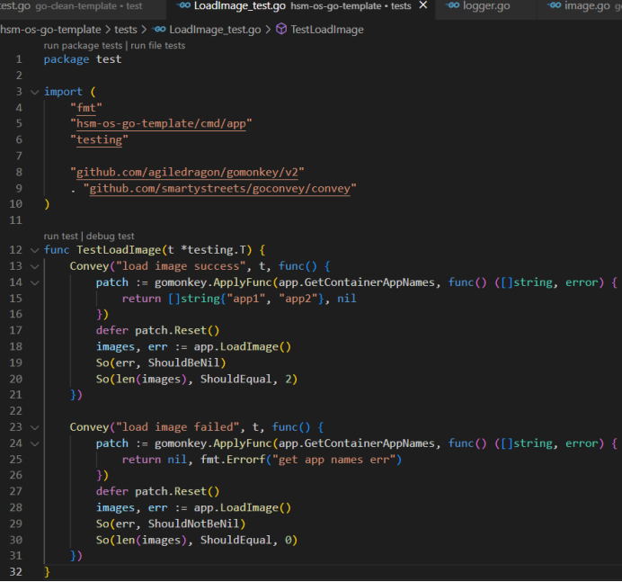

# 1.引入测试框架：
Gomonkey：变量，函数打桩
Goconvey：测试用例管理，结果断言，（可视化）
引入方式（离线方式）：将最新go代码框架vendor目录下该四个目录拷贝到云桌面内
对应工程vendor目录下


# 2.测试用例目录规范：
2.1.  Go文件同级目录下创建xxx_test.go 
2.2.  涉及测试用例用到的材料放在工程根目录tests目录下

# 3. 测试用例示例


执行：在工程根目录下执行go test ./...  则会遍历目录执行所有目录下的测试用例
可以通过-run !./{path}对目录进行过滤豁免。如:
```
go test ./... -run !./tests !./config
PS E:\gospace\src\hsm-os-go-template> go test ./... -run !./tests !./config
?       hsm-os-go-template/cmd  [no test files]
?       hsm-os-go-template/cmd/app      [no test files]
ok      hsm-os-go-template/config       0.310s [no tests to run]
?       hsm-os-go-template/internal/app [no test files]
?       hsm-os-go-template/internal/constants   [no test files]
?       hsm-os-go-template/internal/controller/v1       [no test files]
?       hsm-os-go-template/internal/entity      [no test files]
ok      hsm-os-go-template/internal/usecase     0.242s [no tests to run]
?       hsm-os-go-template/internal/usecase/repo        [no test files]
?       hsm-os-go-template/internal/usecase/webapi      [no test files]
ok      hsm-os-go-template/internal/utils       0.248s [no tests to run]
?       hsm-os-go-template/pkg/httpserver       [no test files]
?       hsm-os-go-template/pkg/logger   [no test files]
?       hsm-os-go-template/pkg/sqllite  [no test files]
ok      hsm-os-go-template/tests        0.540s [no tests to run]
```

# 4.测试用例目标：
场景覆盖率：80%
场景梳理：0. 加载镜像 1. 运行容器 2. 运行容器端口映射 3. 运行容器cpu限制 4. 运行容器memory限制 5. 运行容器目录挂载 6. 运行容器日志挂载 7. 运行容器环境变量 8 . 删除容器 9. 运行容器cni网络 10. 运行容器跨主机网络通信

1）. 可以一个用例覆盖几个场景，不必每个场景需要单独一个用例去覆盖
例如：运行容器，涉及容器运行资源限制，容器日志目录，端口映射等场景可以在一个用例里面同时覆盖
2）. 轻量级测试
例如：运行容器，在校验用例结果时，只需检查容器对象属性
3）. 关注点分离，对测试场景支撑的部分可以采取打桩处理
例如：加载镜像，加载本地node.ini文件可以采用函数打桩
4）. 用例主要关注核心业务，像应用层，接口层可以不太关注
例如：加载镜像，端到端加载需要执行hsm-env imageload，应用层不用关注

代码覆盖率：80%
1）. 场景覆盖率是目标，代码覆盖率作为检验参考（是否遗漏场景，或者存在无效代码）

# 5.测试用例的价值：
更好的守护功能，大胆的重构。
测试用例驱动出更好的代码
（最近的代码走查问题整改可以和测试用例结合起来搞。）