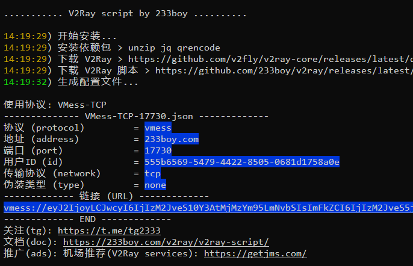

# 背景介绍
我们要上网查询一些学习资料时，要下载一些镜像时，常碰到下载不下来，网页打开慢或者打不开的问题，就好像有一张无形的墙拦住了一样。这个文章讲一讲如何跨过这张无形的墙

# 解决方案
## 1. 科学上网
首先，你需要科学上网，科学上网可以让你上网更加顺畅，不受墙的限制。

## 2. 选择合适的镜像源
选择一个合适的镜像源，可以让你下载速度更快，并且可以解决下载不下来的问题。

## 3. 实在还是不能满足可以看看下面的方法
### 3.1 购买一台海外的云服务器（香港的就可以）
购买云服务器的步骤略过。
假设已经买好了服务器，本地通过xshell等ssh工具连接到了这台服务器。

### 3.1 下载安装v2ray
github地址：https://github.com/233boy/v2ray
安装：在云服务上执行如下指令一键安装
bash <(wget -qO- -o- https://git.io/v2ray.sh)
执行完成会有如下输出：

可以通过命令查询v2ray的运行状态：
systemctl status v2ray

### 3.2 配置客户端（以下以windows系统下安装v2rayN为例）
下载安装包：
wget https://github.com/2dust/v2rayN/releases/download/v3.27/v2rayN-v3.27.zip
解压：
unzip v2rayN-v3.27.zip
启动：
双击v2rayN.exe
配置：

### 3.3 配置完成，浏览器设置代理即可正常使用了

### 3.4 要是公司内部使用可能要将v2rayN的端口映射到公司内网，这样就可以在公司内网下访问互联网了。这样可以在内网选择一台有图形界面的服务器，配置好v2rayN，然后通过内网访问互联网。其他服务器就可以将代理设置为这台机器的转发端口正常上网了。
设置代理的指令：
windows下：
set HTTP_PROXY=http://172.20.3.88:1088
set HTTPS_PROXY=http://172.20.3.88:1088
linux下：
export HTTP_PROXY=http://172.20.3.88:1088;export HTTPS_PROXY=http://172.20.3.88:1088;